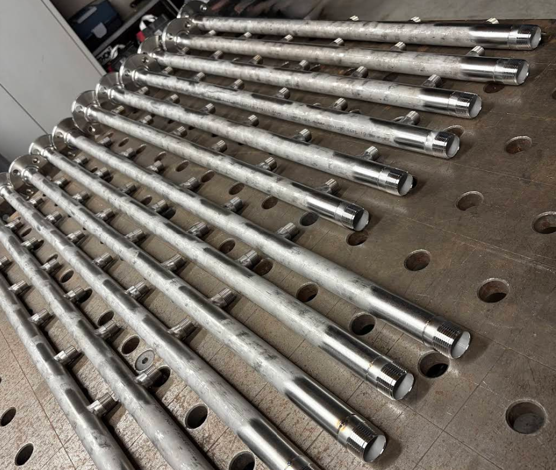

# 📝 Système de Gestion du Blog - JS Industrie

Ce document explique comment utiliser le système de gestion du blog (CMS) pour créer, modifier et supprimer des articles sans toucher au code.

## 🚀 Accès à l'Administration

### URL d'accès
```
https://votre-site.fr/admin.html
```

### Mot de passe par défaut
```
js-industrie-admin-2024
```

⚠️ **IMPORTANT** : Changez ce mot de passe après l'installation !

## 🔒 Changer le Mot de Passe

1. Ouvrez le fichier `blog-api.php`
2. Trouvez la ligne :
```php
define('ADMIN_PASSWORD', 'js-industrie-admin-2024');
```
3. Remplacez par votre nouveau mot de passe :
```php
define('ADMIN_PASSWORD', 'votre-nouveau-mot-de-passe-securise');
```
4. Sauvegardez le fichier

## ✍️ Créer un Nouvel Article

1. **Connectez-vous** à l'administration (`admin.html`)
2. Cliquez sur **"+ Nouvel Article"**
3. Remplissez le formulaire :
   - **Titre*** : Titre de votre article
   - **Catégorie*** : Choisissez parmi :
     - Actualités
     - Projets
     - Technique
     - Sécurité
   - **Auteur*** : Nom de l'auteur (par défaut : JS Industrie)
   - **Image** : Photo de couverture (optionnelle)
     - Formats acceptés : JPG, PNG, GIF, WebP
     - Taille max : 5MB
   - **Extrait*** : Résumé court (2-3 phrases)
   - **Contenu*** : Article complet (HTML ou texte)

4. Cliquez sur **"Enregistrer l'article"**

## ✏️ Modifier un Article

1. Connectez-vous à l'administration
2. Trouvez l'article dans la liste
3. Cliquez sur **"✏️ Modifier"**
4. Modifiez les champs souhaités
5. Cliquez sur **"Enregistrer l'article"**

💡 **Astuce** : Pour changer l'image, uploadez une nouvelle image lors de la modification.

## 🗑️ Supprimer un Article

1. Connectez-vous à l'administration
2. Trouvez l'article dans la liste
3. Cliquez sur **"🗑️ Supprimer"**
4. Confirmez la suppression

⚠️ **Attention** : La suppression est définitive !

## 📋 Format du Contenu

### Texte Simple
Vous pouvez écrire du texte normal :
```
Ceci est un paragraphe simple.
```

### HTML pour Plus de Style
Pour un meilleur contrôle, utilisez du HTML :

```html
<h2>Titre de section</h2>
<p>Paragraphe de texte.</p>

<h3>Sous-titre</h3>
<p>Autre paragraphe avec <strong>texte en gras</strong> et <em>italique</em>.</p>

<ul>
  <li>Premier point</li>
  <li>Deuxième point</li>
  <li>Troisième point</li>
</ul>

<blockquote>
  Citation importante
</blockquote>
```

### Insérer des Images dans le Contenu
```html

<p class="caption">Légende de l'image</p>
```

### Créer des Liens
```html
<a href="https://example.com">Texte du lien</a>
```

## 📂 Structure des Fichiers

```
JS-INDUSTRIE/
├── admin.html                    ← Page d'administration
├── blog-api.php                  ← API pour gérer les articles
├── blog.html                     ← Page d'affichage du blog
├── data/
│   └── articles.json             ← Base de données des articles
├── images/
│   └── blog/                     ← Images uploadées (auto-créé)
└── js/
    ├── admin.js                  ← JavaScript de l'admin
    └── blog.js                   ← JavaScript du blog public
```

## 🔄 Comment ça Fonctionne

### Stockage des Articles
- Les articles sont stockés dans `data/articles.json`
- Format JSON simple et lisible
- Pas besoin de base de données MySQL

### Images
- Images uploadées dans `images/blog/`
- Nom unique généré automatiquement
- Formats supportés : JPG, PNG, GIF, WebP

### Affichage Public
- Les articles apparaissent automatiquement sur `blog.html`
- Filtrage par catégorie fonctionnel
- Les plus récents en premier

## 🎨 Catégories Disponibles

| Catégorie | Description | Badge |
|-----------|-------------|-------|
| **Actualités** | News de l'entreprise | 🔵 Bleu |
| **Projets** | Réalisations terminées | 🟢 Vert |
| **Technique** | Articles techniques | 🟣 Violet |
| **Sécurité** | Normes et sécurité | 🔴 Rouge |

## 🔧 Personnalisation

### Ajouter une Catégorie

1. Dans `admin.html`, ajoutez une option dans le `<select>` :
```html
<option value="innovation">Innovation</option>
```

2. Dans `js/blog.js` et `js/admin.js`, ajoutez le label :
```javascript
const labels = {
    'actualites': 'Actualités',
    'projets': 'Projets',
    'technique': 'Technique',
    'securite': 'Sécurité',
    'innovation': 'Innovation'  // ← Ajoutez ici
};
```

3. Dans `blog.html`, ajoutez un bouton de filtre :
```html
<button class="filter-btn" data-category="innovation">Innovation</button>
```

### Changer le Nombre d'Articles par Page

Actuellement, tous les articles sont affichés. Pour ajouter une pagination :
- Modifiez `js/blog.js`
- Implémentez la logique de pagination

## 🐛 Dépannage

### Les articles n'apparaissent pas
1. Vérifiez que `data/articles.json` existe
2. Vérifiez les permissions du dossier `data/` (droit d'écriture)
3. Ouvrez la console JavaScript (F12) pour voir les erreurs

### Impossible d'uploader des images
1. Vérifiez que le dossier `images/blog/` existe
2. Vérifiez les permissions (chmod 755)
3. Vérifiez la taille du fichier (max 5MB)
4. Vérifiez le format (JPG, PNG, GIF, WebP)

### Mot de passe refusé
1. Vérifiez que vous utilisez le bon mot de passe dans `blog-api.php`
2. Videz le cache du navigateur
3. Vérifiez qu'il n'y a pas d'espaces avant/après le mot de passe

### Erreur 500
1. Consultez les logs PHP : `/var/log/apache2/error.log`
2. Vérifiez la syntaxe PHP : `php -l blog-api.php`
3. Vérifiez les permissions des fichiers

## 📊 Sauvegarder les Articles

### Sauvegarde Manuelle
Téléchargez simplement le fichier `data/articles.json` :
```bash
scp user@votre-serveur:~/public_html/data/articles.json ./backup/
```

### Restauration
Uploadez le fichier sauvegardé :
```bash
scp ./backup/articles.json user@votre-serveur:~/public_html/data/
```

### Sauvegarde Automatique (Recommandé)
Ajoutez une tâche cron :
```bash
# Sauvegarde quotidienne à 2h du matin
0 2 * * * cp /path/to/data/articles.json /path/to/backups/articles-$(date +\%Y\%m\%d).json
```

## 🚀 Migration depuis un Autre CMS

### Depuis WordPress
1. Exportez vos articles en JSON
2. Transformez-les au format requis :
```json
{
  "id": "unique-id",
  "slug": "url-slug",
  "title": "Titre",
  "category": "actualites",
  "excerpt": "Résumé",
  "content": "Contenu HTML",
  "author": "Auteur",
  "image": "nom-image.jpg",
  "date": "2024-11-05 10:30:00",
  "views": 0
}
```
3. Importez dans `data/articles.json`

## 📱 Responsive

Le CMS et le blog sont 100% responsive :
- ✅ Desktop (ordinateur)
- ✅ Tablette
- ✅ Mobile (smartphone)

## 🔐 Sécurité

### Bonnes Pratiques

1. **Changez le mot de passe** immédiatement
2. **Utilisez HTTPS** (obligatoire)
3. **Sauvegardez régulièrement** `data/articles.json`
4. **Limitez l'accès** à `admin.html` via .htaccess (optionnel)

### Protection du Fichier Admin (Apache)

Créez `.htaccess` dans le dossier racine :
```apache
<Files "admin.html">
    # Autoriser seulement votre IP
    Require ip 123.456.789.0
</Files>
```

### Protection Avancée

Pour plus de sécurité, ajoutez une authentification HTTP basique :
```apache
<Files "admin.html">
    AuthType Basic
    AuthName "Administration"
    AuthUserFile /path/to/.htpasswd
    Require valid-user
</Files>
```

## 💡 Astuces

### Planifier un Article

Modifiez manuellement la date dans `data/articles.json` pour une date future, puis ajoutez un filtre dans `blog.js` pour n'afficher que les articles dont la date est passée.

### Ajouter des Vues

Le champ `views` est présent mais non utilisé. Vous pouvez implémenter un compteur de vues en modifiant `blog-api.php`.

### SEO

Pour un meilleur SEO :
1. Utilisez des titres descriptifs
2. Rédigez des extraits engageants
3. Uploadez des images optimisées
4. Utilisez du HTML sémantique dans le contenu

## 📞 Support

Pour toute question :
- Email : flo.lonjarret@gmail.com
- Consultez `INSTALLATION.md` pour la configuration serveur

---

**Version** : 1.0
**Dernière mise à jour** : Novembre 2024
